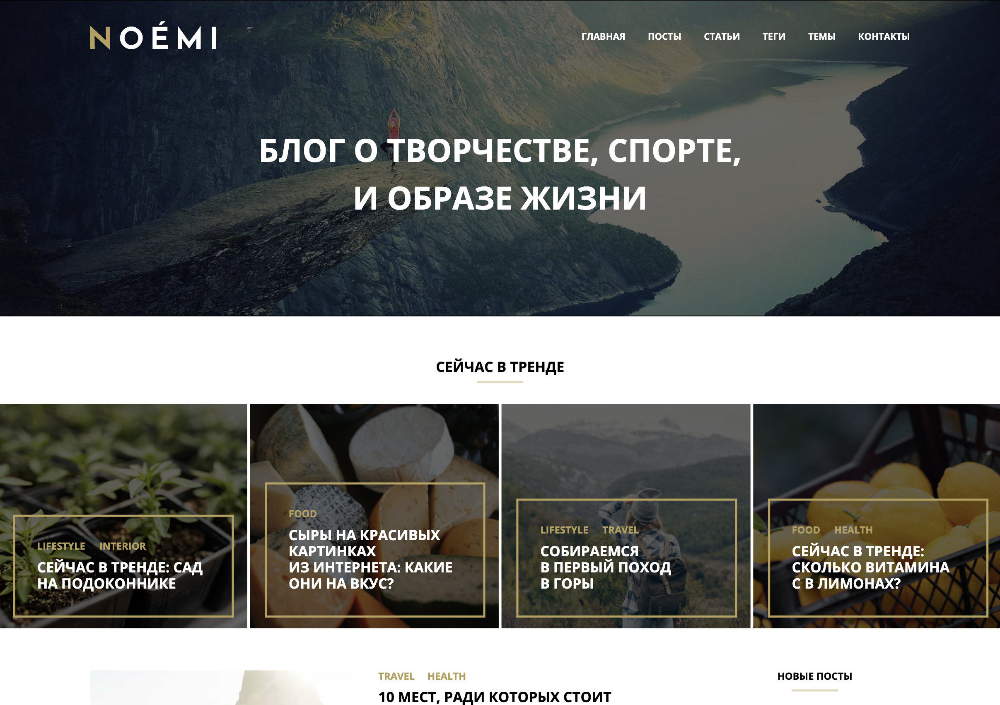

# NOEMI — адаптивная вёрстка сайта

NOEMI — учебный проект по HTML- и CSS-вёрстке адаптивной страницы блога о творчестве, спорте и образе жизни.

Страница свёрстана по предоставленным дизайн-макетам для десктопа, планшета и смартфона с учётом изменения ширины экрана и ориентации устройства.

Проект выполнен в рамках итоговой работы по модулю «Адаптивная и мобильная вёрстка» Нетологии.

<p align="center">
  
</p>

**[Открыть сайт](https://potykalov.github.io/mq-diploma/)** ·
[HTML-разметка](index.html) ·
[CSS-стили](css/)

## Содержание

<p align="center">
  <a href="#основные-особенности">Возможности</a> ·
  <a href="#мой-вклад">Мой вклад</a> ·
  <a href="#технологии">Технологии</a>
  <br>
  <a href="#техническая-реализация">Техническая реализация</a> ·
  <a href="#установка-и-запуск">Запуск</a> ·
  <a href="#исходные-дизайн-макеты">Макеты</a>
</p>

## Основные особенности

- Адаптивная вёрстка для десктопных, планшетных и мобильных экранов.
- Семантическая HTML-разметка.
- Адаптивные сетки публикаций, трендов и товаров.
- Изменение расположения элементов при повороте устройства.
- Отображение изображений с учётом ширины экрана.
- Формы поиска, подписки и обратной связи.
- Адаптация навигации для мобильных устройств.
- Оформление элементов интерфейса с помощью CSS.

## Мой вклад

Проект выполнен на основе [дизайн-макетов Нетологии](https://github.com/netology-code/mq-diploma).

В исходных материалах были предоставлены макеты, изображения, шрифты и графические элементы.

В ходе выполнения работы я:

- Реализовал HTML-разметку страницы с использованием семантических элементов.
- Сверстал шапку сайта, навигацию и блок «Сейчас в тренде».
- Реализовал основной список публикаций и боковую панель.
- Добавил раздел с карточками товаров.
- Реализовал HTML-разметку форм поиска, подписки и обратной связи.
- Настроил адаптивные сетки с использованием Flexbox.
- Добавил CSS-медиазапросы для изменения расположения элементов на разных экранах.
- Реализовал адаптацию блока трендов к ориентации устройства.
- Настроил отображение изображений с помощью HTML-элемента `picture`.
- Добавил оформление элементов интерфейса при наведении и получении фокуса.

Проект представляет собой статическую HTML-страницу без серверной части и JavaScript-логики.

## Технологии

**Разметка:** HTML5, семантические элементы, формы, picture.

**Стилизация:** CSS3, Flexbox, Media Queries, псевдоэлементы, псевдоклассы.

**Графика:** SVG, адаптивные изображения, локальные веб-шрифты.

**Публикация:** GitHub Pages.

В проекте не использовались JavaScript-фреймворки, CSS-препроцессоры или сборщики.

## Техническая реализация

### Адаптивная вёрстка

При разработке использовал подход Mobile First.

Базовые стили определены для мобильной версии страницы, а для планшетных и десктопных экранов подключаются дополнительные CSS-файлы.

Основные точки переключения:

| Устройство | Ширина экрана |
| --- | --- |
| Смартфон | До 640 px |
| Планшет | От 641 до 1200 px |
| Десктоп | От 1201 px |

**Основные файлы:**

- [mobile.css](css/mobile.css) — базовые стили и мобильная версия.
- [tablet.css](css/tablet.css) — стили для планшетных экранов.
- [desktop.css](css/desktop.css) — стили для десктопных экранов.

### Построение адаптивных сеток

Для расположения основных блоков использовал Flexbox.

С помощью `display: flex`, `flex-direction`, `flex-wrap` и других CSS-свойств реализовал сетки публикаций, трендов и товаров.

Медиазапросы изменяют направление и размеры элементов в зависимости от ширины экрана.

Это позволяет адаптировать расположение контента без использования JavaScript.

### Адаптация к ориентации устройства

Для блока «Сейчас в тренде» реализовал изменение количества колонок с помощью CSS-медиазапросов.

На мобильных устройствах при переходе в альбомную ориентацию карточки располагаются в две колонки.

На планшетных экранах в альбомной ориентации количество колонок увеличивается до четырёх.

### Адаптивные изображения

Для отображения изображений в карточках товаров использовал HTML-элемент `picture`.

Это позволяет выбирать подходящий графический ресурс в зависимости от условий отображения.

Дополнительно настроил размеры изображений и их размещение внутри контейнеров с сохранением пропорций.

### Семантическая разметка

При создании HTML-структуры использовал семантические элементы для разделения основных областей страницы.

Реализовал разметку навигации, публикаций, боковой панели и форм.

Для контентных изображений добавил альтернативные текстовые описания.

## Установка и запуск

Проект представляет собой статическую HTML-страницу и не требует установки зависимостей.

**1. Клонируйте репозиторий**

```bash
git clone https://github.com/potykalov/mq-diploma.git
cd mq-diploma
```

**2. Откройте страницу**

Откройте файл `index.html` в браузере.

Также сайт опубликован на GitHub Pages:

[Открыть NOEMI](https://potykalov.github.io/mq-diploma/)

## Исходные дизайн-макеты

<p align="center">
  
</p>

Вёрстка выполнена на основе предоставленных макетов с адаптацией элементов к промежуточным размерам экрана.

## Лицензия

[Лицензия MIT](LICENSE).

Дизайн-макеты, изображения, шрифты и графические материалы предоставлены в рамках учебного задания.

## Автор и контакты

**Дмитрий Потыкалов — Junior Frontend Developer**

[Резюме](https://drive.google.com/file/d/1-FthWK2FrCPop39JiLnkouS1WSrIpZer/view) ·
[Email](mailto:dmitriy.potykalov@gmail.com) ·
[Telegram](https://t.me/dmitriy_potykalov)  ·
[LinkedIn](https://www.linkedin.com/in/potykalov)
